# ✨ StayLux — Lüks Otel Arama & Seyahat Planlama Platformu

> **RapidAPI** ile güçlendirilmiş, dünya genelinde **2 milyondan fazla otel** arasından arama yapabileceğiniz modern lüks seyahat platformu.  
> Otel arama, rezervasyon, AI destekli tur planlayıcı ve canlı seyahat araçlarını tek çatı altında sunar.

---

## 📸 Proje Görselleri

### 🏠 Ana Sayfa — Hero & Otel Arama Formu

| Ana Sayfa |
|:-:|
| 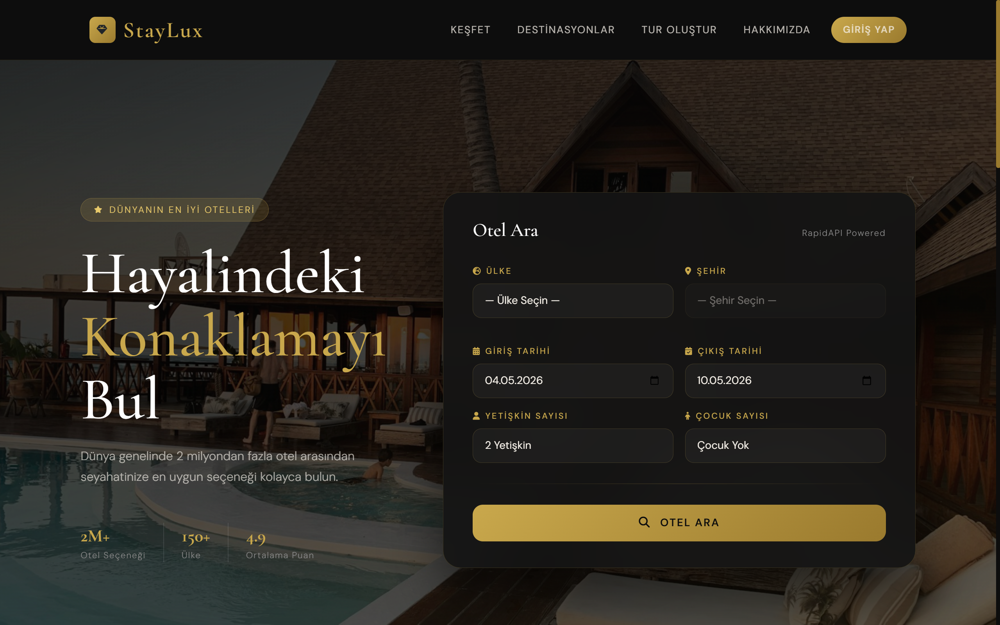 |

---

### 🛠️ Seyahat Araçları — Canlı Veriler

| Döviz Kurları, Çevirici, Hava Durumu & Kripto Piyasası |
|:-:|
| 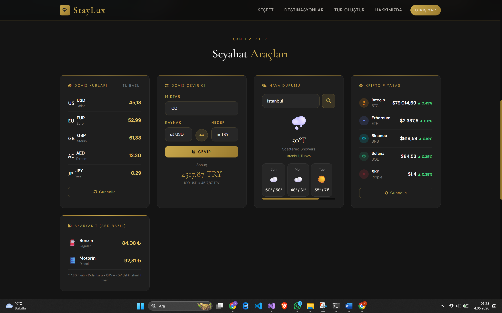 |

---

### 🔍 Otel Arama Sayfası

| Filtreler & Destinasyon Seçici |
|:-:|
| 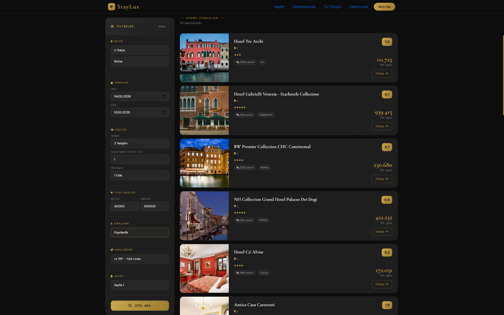 |

---

###  🃏 Yapay Zeka İle Tur Programınızı Oluşturun

| Tur Oluşturma Paneli |
|:-:|
| 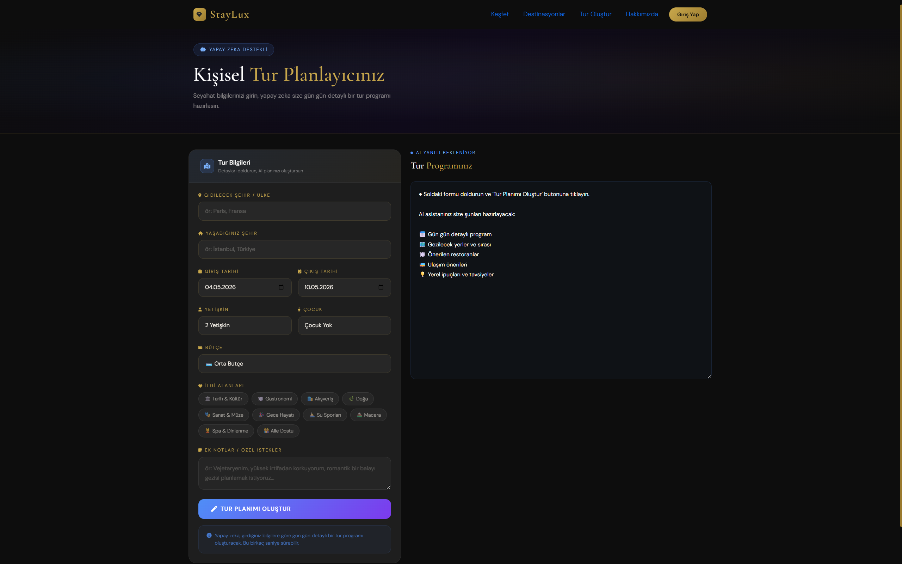 |

---
###  🤖 AI Destekli Kişisel Tur Planlayıcı
| AI Tarafından Oluşturulan Tur Programı |
|:-:|
| 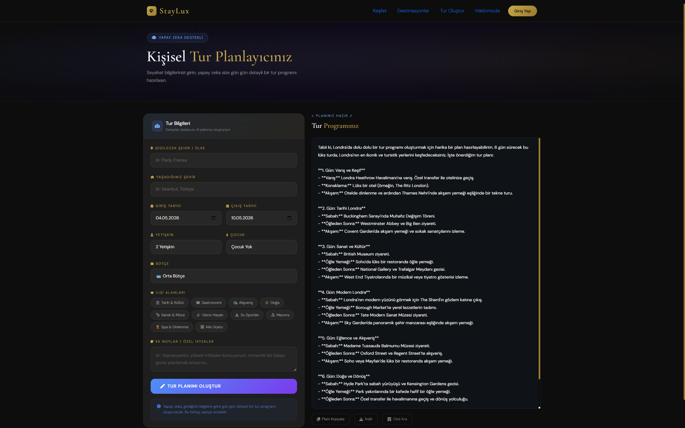 |
---
### 📋 Arama Sonuçları — Liste Görünümü (Roma)

| Roma Otelleri — Liste Görünümü |
|:-:|
| 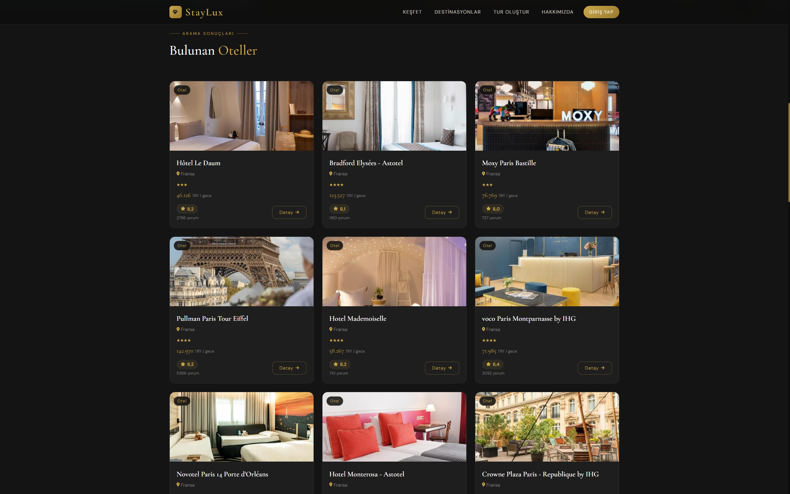 |

---

### 🏨 Otel Detay Sayfası

|  Fotoğraf Galerisi, Özellikler & Rezervasyon Paneli|
|:-:|
| 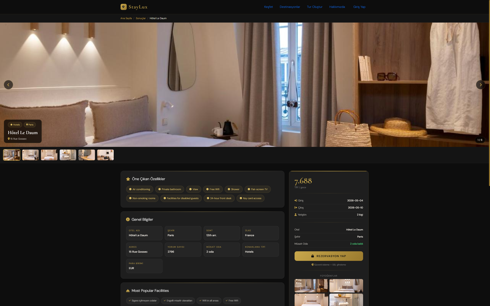 |

| Oda Bilgileri, Google Maps & Konum |
|:-:|
| 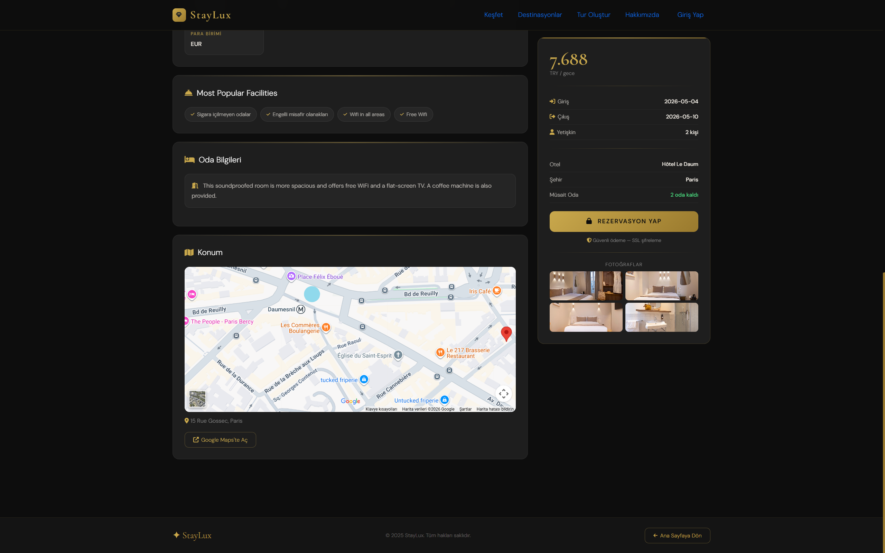 |


---


|  Keşfet — Popüler Destinasyonlar  |
|:-:|
| 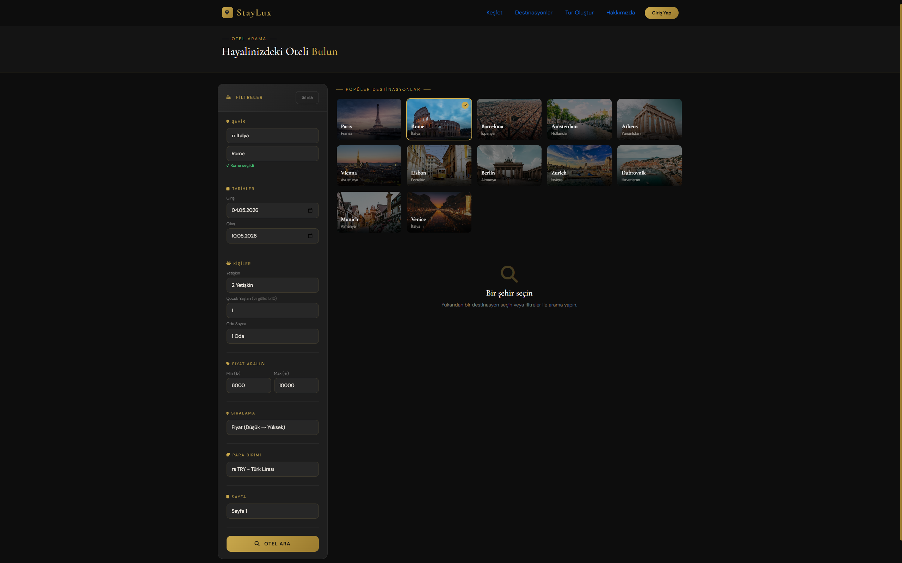 |

---

### Hakkımızda Sayfası

| Biz Kimiz?  |

 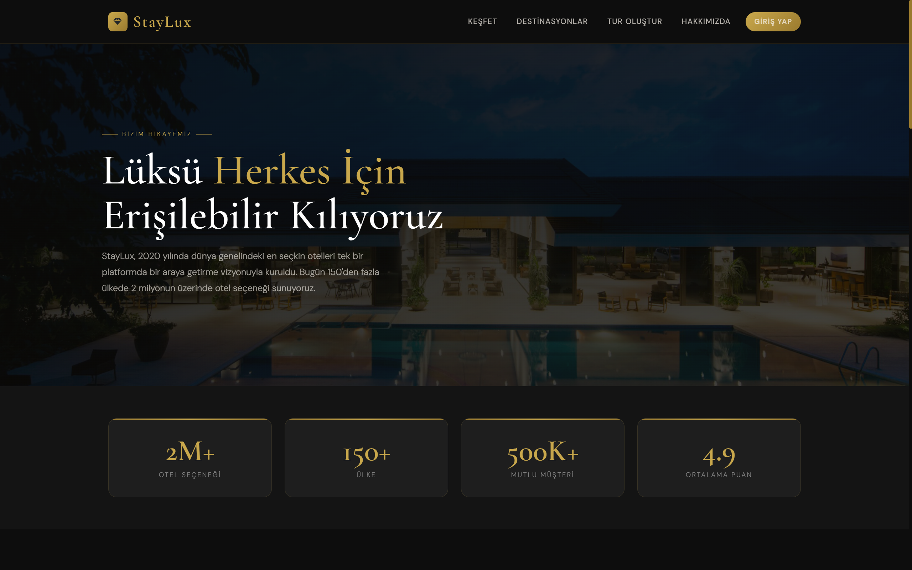 |

---

### 🏢 Hakkımızda Sayfası

| Vizyon — Lüksü Herkes İçin Erişilebilir Kılıyoruz |
|:-:|
| 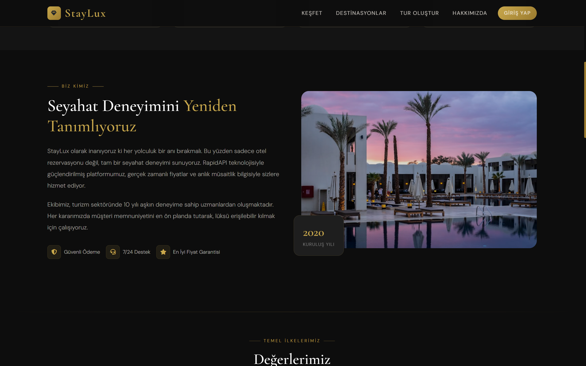 |

| Seyahat Deneyimini Yeniden Tanımlıyoruz |
|:-:|
| 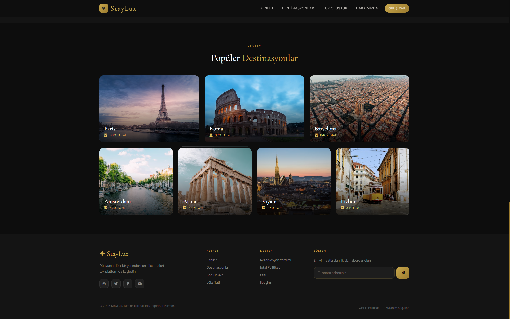 |

| Değerlerimiz & Tarihçemiz |
|:-:|
| 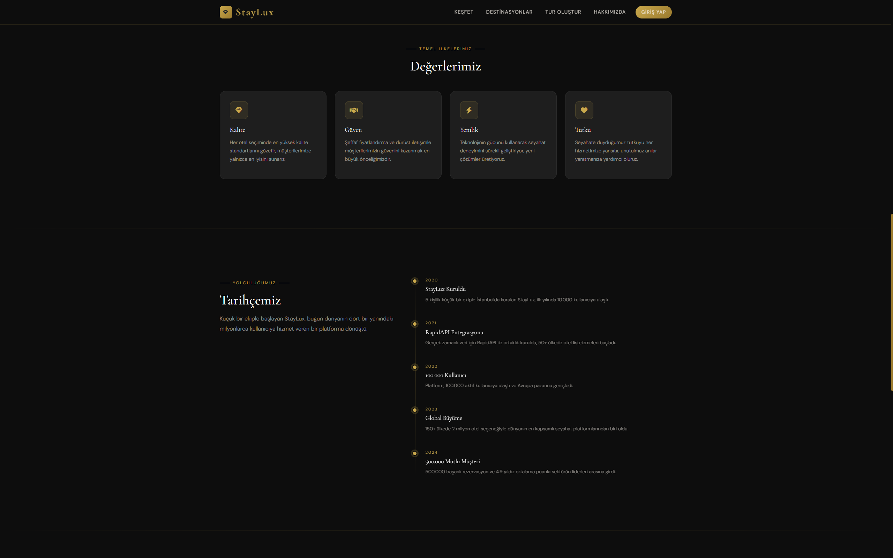 |

| Ekibimiz |
|:-:|
| 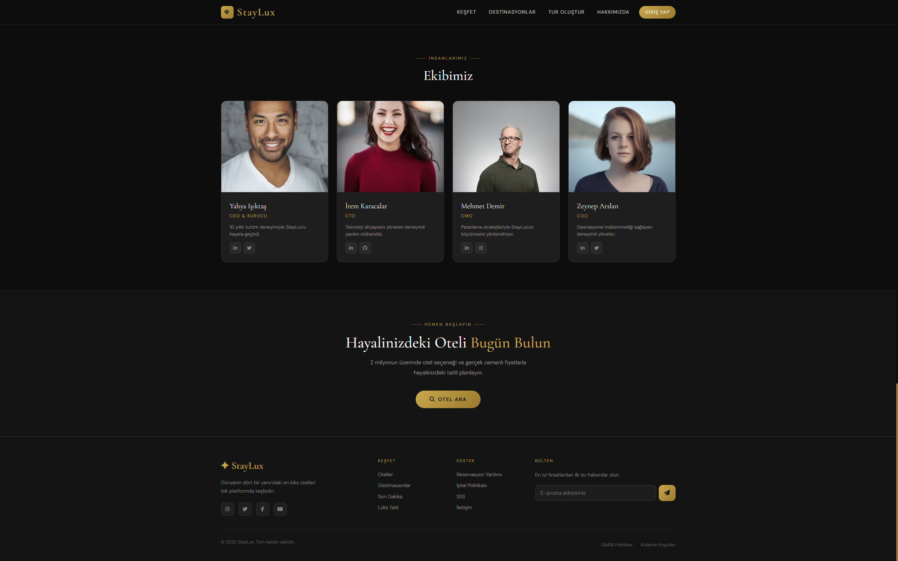 |

---

## 🧩 Uygulama Özellikleri

### 🌐 Kullanıcı Arayüzü

| Özellik | Açıklama |
|---------|----------|
| 🏠 Ana Sayfa | Hero alanı, RapidAPI destekli otel arama formu (ülke, şehir, tarih, yetişkin & çocuk sayısı) |
| 🔍 Otel Arama | Filtreli arama: şehir, tarih, kişi, oda sayısı, fiyat aralığı, sıralama, para birimi, sayfalama |
| 🃏 Otel Listesi | Grid ve liste görünümü — fotoğraf, yıldız, puan, yorum sayısı, gecelik fiyat |
| 🏨 Otel Detayı | Fotoğraf galerisi, öne çıkan özellikler, oda bilgileri, Google Maps entegrasyonu, rezervasyon paneli |
| 🌍 Destinasyonlar | Paris, Roma, Barcelona, Amsterdam, Atina, Viyana, Lizbon ve daha fazlası |
| 🤖 Tur Planlayıcı | AI destekli: şehir, tarih, bütçe, ilgi alanları ve özel isteklere göre gün gün detaylı tur programı |
| 🛠️ Seyahat Araçları | Canlı döviz kurları, döviz çevirici, hava durumu, kripto piyasası, akaryakıt fiyatları |
| 🏢 Hakkımızda | Vizyon, istatistikler, ekip, değerler ve şirket tarihçesi (2020–2024) |

---

### 🤖 Yapay Zeka — Kişisel Tur Planlayıcı

Kullanıcı bilgilerini girerek OpenAI destekli kişisel tur programı oluşturabilir:

- 📍 Gidilecek şehir / ülke ve yaşanılan şehir
- 📅 Giriş & çıkış tarihleri
- 👥 Yetişkin & çocuk sayısı
- 💰 Bütçe (düşük / orta / lüks)
- ❤️ İlgi alanları: Tarih & Kültür, Gastronomi, Alışveriş, Doğa, Sanat & Müze, Gece Hayatı, Su Sporları, Macera, Spa & Dinlenme, Aile Dostu
- 📝 Özel notlar ve istekler

AI çıktısı: **Gün gün detaylı program, gezilecek yerler ve sırası, önerilen restoranlar, ulaşım önerileri, yerel ipuçları.** Planı kopyalama, indirme ve direkt otel arama bağlantısı ile desteklenir.

---

## 🏗️ Kullanılan Teknolojiler

### Frontend & Backend

| Teknoloji | Kullanım Amacı |
|-----------|----------------|
| ASP.NET Core MVC | Web uygulama çatısı |
| Razor Pages / HTML & CSS | View katmanı |
| JavaScript | Dinamik arama, filtre, harita entegrasyonu |
| Bootstrap / Özel CSS | Lüks karanlık tema, responsive tasarım |

### 🔌 API & Entegrasyonlar

| Teknoloji | Kullanım Amacı |
|-----------|----------------|
| RapidAPI — Booking.com | Gerçek zamanlı otel arama, fiyat ve müsaitlik |
| OpenAI GPT API | Kişisel tur programı oluşturma |
| Google Maps API | Otel konumu ve harita gösterimi |
| Döviz Kuru API | Canlı TL bazlı döviz kurları |
| Hava Durumu API | Destinasyon bazlı anlık hava durumu |
| Kripto Piyasa API | Bitcoin, Ethereum, BNB, SOL, XRP fiyatları |
| Akaryakıt Fiyat API | ABD bazlı benzin ve motorin fiyatları |

---

## ⚙️ Kurulum

### Gereksinimler

- .NET 8 SDK
- Visual Studio 2022
- RapidAPI Key (Booking.com entegrasyonu)
- OpenAI API Key (Tur Planlayıcı)
- Google Maps API Key

### 1. Repoyu Klonla

```bash
git clone https://github.com/isiktasyahya/RapidApi_BookingProject.git
cd RapidApi_BookingProject
```

### 2. API Anahtarlarını Ayarla

`appsettings.json` dosyasını düzenle:

```json
{
  "ApiKeys": {
    "RapidApi": "YOUR_RAPIDAPI_KEY",
    "OpenAI": "YOUR_OPENAI_API_KEY",
    "GoogleMaps": "YOUR_GOOGLE_MAPS_API_KEY"
  }
}
```

### 3. Projeyi Çalıştır

```bash
cd RapidApi_BookingProject
dotnet run
```

---

## 📁 Proje Yapısı

```
RapidApi_BookingProject/
│
├── images/                  # README görselleri
├── Controllers/             # MVC controller'lar
├── Models/                  # View modeller & API response modelleri
├── Views/                   # Razor view dosyaları
│   ├── Home/                # Ana sayfa & seyahat araçları
│   ├── Hotel/               # Otel arama, liste, detay
│   ├── Tour/                # AI tur planlayıcı
│   └── About/               # Hakkımızda sayfası
├── Services/                # API servis katmanı
├── wwwroot/                 # Statik dosyalar (CSS, JS, img)
├── appsettings.json         # Uygulama konfigürasyonu
└── Program.cs               # Uygulama başlangıç noktası
```

---

## 🌟 Proje Öne Çıkanlar

- ✅ **RapidAPI entegrasyonu** — 2M+ otel, gerçek zamanlı fiyat ve müsaitlik
- ✅ **AI destekli tur planlayıcı** — kişiye özel gün gün detaylı seyahat programı
- ✅ **5 canlı veri kaynağı** — döviz, hava durumu, kripto, akaryakıt tek ekranda
- ✅ **Google Maps entegrasyonu** — her otelin konumunu haritada görme
- ✅ **Kapsamlı filtreleme** — fiyat aralığı, sıralama, para birimi, sayfalama
- ✅ **Lüks karanlık tema** — siyah & altın renk paleti ile premium tasarım
- ✅ **Tam responsive** — masaüstü ve mobil uyumlu arayüz

---

## 👤 Geliştirici

**Yahya Işıktaş**  
📧 isiktsayahya7@gmail.com  
📍 Gaziosmanpaşa / İstanbul  
🐙 [github.com/isiktasyahya](https://github.com/isiktasyahya)

---

> *"Dünyanın dört bir yanındaki en lüks otelleri tek platformda keşfedin."*  
> — StayLux
